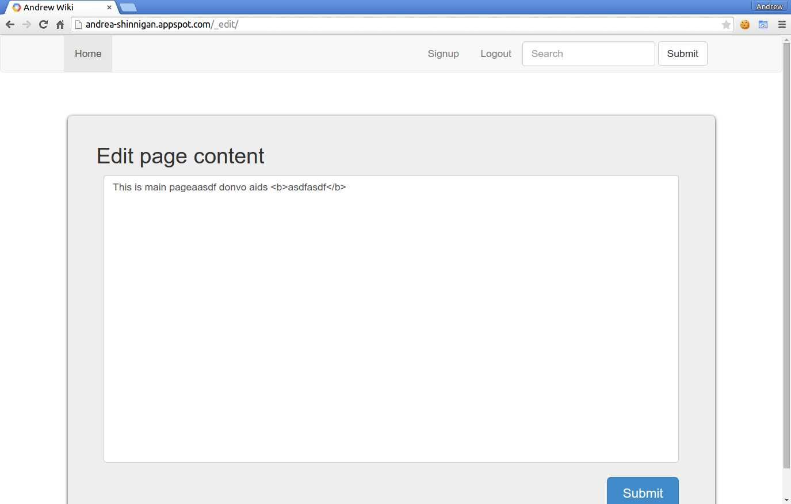

# andrewWiki

#### Wiki page built using webapp2 and hosted using Google App Engine. (http://andrea-shinnigan.appspot.com/)

#### Add path after andrea-shinnigan.appspot.com/ navigate to a page. 
For example, andrea-shinnigan.appspot.com/newpage.

#### If you are logged-in and a page does not exist for a path, the site allows you to add a new page. 
For example, if there is no page for andrea-shinnigan.appspot.com/nopage and you are logged-in, 
you can add a page for this url path.

#### Also, by logging in, you are allowed to edit an existing page and view the edit history of it.

#### Search funtionality is not implemented yet.

